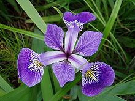

# Iris k-NN
Classification k-Nearest Neighbor (k-NN)

**Iris Setosa**|**Iris Versicolor**|**Iris Virginica**|
:--:|:--:|:--:
||
[iris-setosa](https://en.wikipedia.org/wiki/Iris_setosa)|[iris-versicolor](https://en.wikipedia.org/wiki/Iris_versicolor)|[iris-virginica](https://en.wikipedia.org/wiki/Iris_virginica)

##### Download Iris dataset: [https://archive.ics.uci.edu/ml/datasets/Iris](https://archive.ics.uci.edu/ml/datasets/Iris)

### About k-nearest neighbors algorithm (k-NN)
**View: [wikipedia](https://en.wikipedia.org/wiki/K-nearest_neighbors_algorithm)**

### Results view [main.py](https://github.com/radensaleh/Iris-kNN/blob/master/main.py).

## License
[MIT License](https://opensource.org/licenses/MIT) © Raden Saleh
